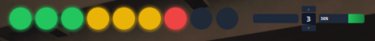
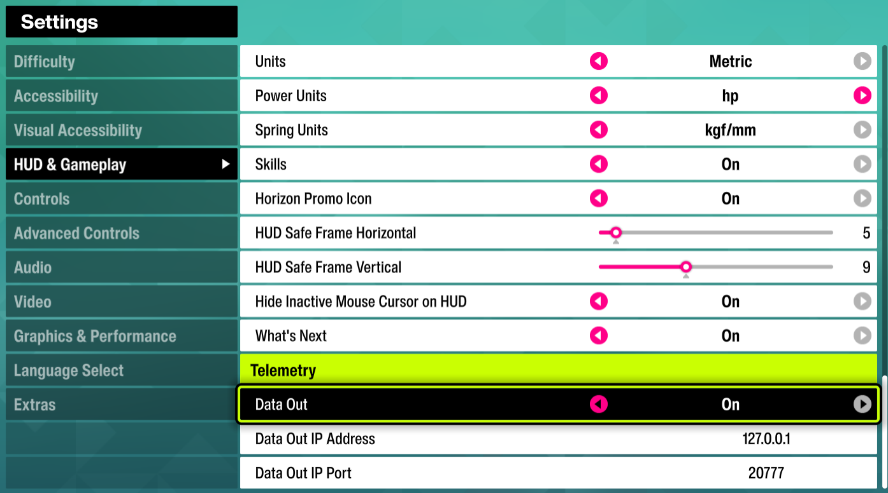
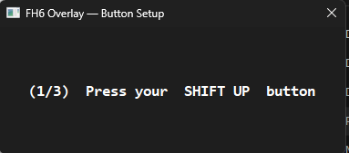

# FH6 Overlay - Getting Started Guide

A real-time rev lights and controller display for Forza Horizon 6, shown as a small transparent bar at the top of your screen.

---

> **This overlay is safe to use and is not bannable.**
>
> FH6 Overlay does not modify, patch, or interact with any game files, game memory, or game processes. It is a completely separate application that reads telemetry data that **Forza itself broadcasts** over your local network via the official built-in Data Out feature. Every major racing game that supports Data Out (Forza, F1, Gran Turismo, iRacing) is designed for exactly this kind of external tool. Nothing here gives you an in-game advantage - it only shows information the game is already sending to you.

> **The exe is clean - no viruses, no malware, no telemetry, no nonsense.**
>
> `FH6Overlay.exe` is a Python script compiled into a standalone executable using [PyInstaller](https://pyinstaller.org), a well-known open-source tool. Because PyInstaller bundles a Python runtime inside the exe, some antivirus software (including Windows Defender) may flag it as suspicious - this is a well-documented false positive that affects virtually all PyInstaller-built apps. **Every single line of source code is publicly available in this repository.** You can read it, audit it, and verify exactly what the program does before running it. If you still prefer not to trust the pre-built exe, you can build it yourself: install Python 3.13 and PyInstaller, clone this repo, and run `python -m PyInstaller FH6Overlay.spec` - you will get an identical executable from the same source.

---

## What You'll See



The overlay shows:

- **9 rev lights** - fill green → yellow → red as you approach the redline, then flash when it's time to shift
- **Brake bar** (left) - red bar showing how hard you're pressing the brake
- **Throttle bar** (right) - green bar showing how hard you're pressing the throttle
- **Gear indicator** (centre) - your current gear, `R` for reverse, `D` for electric cars, and `C` (yellow) when the clutch button is held

---

## Requirements

- Windows 10 or 11
- Forza Horizon 6
- An Xbox controller (or any XInput-compatible gamepad)

---

## Step 1 - Download

Download `FH6Overlay.exe` from the [Releases page](../../releases) and put it anywhere on your PC - your Desktop is fine.

> No installation needed. It's a single file.

---

## Step 2 - Configure Forza Horizon 6

The overlay receives data directly from the game over your local network. You need to turn this on in Forza's settings.

1. In FH6, open **Settings**
2. Go to **HUD and Gameplay**
3. Scroll down to **Data Out**
4. Set **Data Out** to **On**
5. Set **Data Out IP Address** to `127.0.0.1`
6. Set **Data Out IP Port** to `20777`



> These settings are saved and will stay on next time you launch the game.

---

## Step 3 - Run the Overlay

Double-click `FH6Overlay.exe`.

The first time you run it, a small setup window will appear:



It will ask you to press three buttons on your controller:

1. **Press your SHIFT UP button** - the button you use to shift up in Forza
2. **Press your SHIFT DOWN button** - the button you use to shift down
3. **Press your CLUTCH button** - if you use one, press it; if not, click **Skip (no clutch)**

Just press the button when it asks - the wizard detects it automatically.

> Your button assignments are saved to `config.ini` next to the exe. You only need to do this once.

---

## Step 4 - Drive

The overlay will appear as a thin bar at the top-centre of your screen. Launch a race or free-roam session in FH6.


- The rev lights fill up as you rev the engine
- All 9 lights flash when it's time to shift
- The overlay learns your car's real redline over a few upshifts and becomes more accurate the more you drive

> **The overlay sits on top of all windows** - including FH6 in borderless or windowed mode. If you're running FH6 fullscreen exclusive, use borderless windowed mode in the game's display settings.

---

## Quitting

- Press **Escape** or **Ctrl+Q** while the overlay is focused, or
- Right-click the red dot in the **system tray** (bottom-right of your taskbar) and click **Quit**

---

## Troubleshooting

### The overlay appears but the rev lights don't respond

- Make sure Forza's **Data Out** settings are saved and the game is running (not just at the main menu - you need to be in a session with a car)
- Check the IP address is exactly `127.0.0.1` and the port is `20777`
- Make sure no other app is using UDP port 20777

### The controller bars and gear don't appear / show dashes

- Make sure your controller is connected before launching the overlay
- The gear indicator shows `–` until the game sends data - this is normal

### I want to change my button assignments

Delete `config.ini` (it's next to `FH6Overlay.exe`) and restart the overlay. The setup wizard will appear again.

### The rev lights seem to flash too early or too late

The overlay starts with a conservative 90% estimate of your redline and learns the real value from your driving. After a few upshifts in the same car it will be accurate. To reset learned calibrations, delete `calibration.json` next to the exe.

---

## Configuration File

If you want to edit your settings manually, open `config.ini` in any text editor:

```ini
[network]
udp_port = 20777        # Change if you moved Forza's Data Out port

[buttons]
shift_up = 8192         # B button
shift_down = 16384      # X button
clutch = 0              # 0 = disabled
```

Common XInput button values:

| Button | Value |
|--------|-------|
| A      | 4096  |
| B      | 8192  |
| X      | 16384 |
| Y      | 32768 |
| LB     | 256   |
| RB     | 512   |
| Back   | 32    |
| Start  | 16    |
