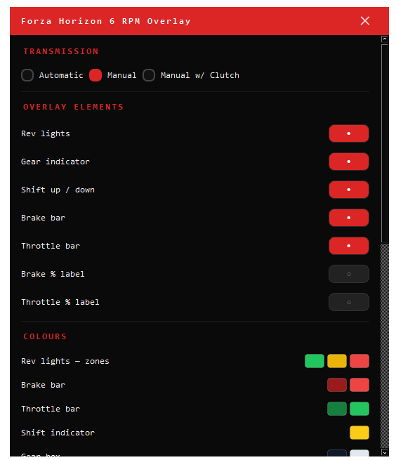
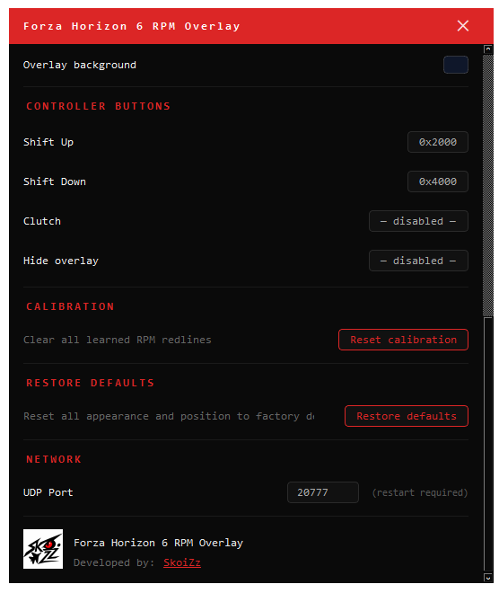

# Forza Horizon 6 RPM Overlay — Getting Started

A real-time rev lights and controller display for Forza Horizon 6, shown as a transparent bar at the top of your screen.

---

> **This overlay is safe to use and is not bannable.**
>
> FH6 Overlay does not modify, patch, or interact with any game files, game memory, or game processes. It is a completely separate application that reads telemetry data that **Forza itself broadcasts** over your local network via the official built-in Data Out feature. Every major racing game that supports Data Out (Forza, F1, Gran Turismo, iRacing) is designed for exactly this kind of external tool. Nothing here gives you an in-game advantage — it only shows information the game is already sending to you.

> **The exe is clean — no viruses, no malware, no telemetry.**
>
> `FH6Overlay.exe` is a Python script compiled into a standalone executable using [PyInstaller](https://pyinstaller.org). Because PyInstaller bundles a Python runtime inside the exe, some antivirus software (including Windows Defender) may flag it as suspicious — this is a well-documented false positive that affects virtually all PyInstaller-built apps. **Every single line of source code is publicly available in this repository.** You can read it, audit it, and verify exactly what the program does before running it. If you still prefer not to trust the pre-built exe, you can build it yourself: install Python 3.13 and PyInstaller, clone this repo, and run `python -m PyInstaller FH6Overlay.spec`.

---

## What You'll See

The overlay shows:

- **9 rev lights** — fill green → yellow → red as you approach the redline, then flash when it's time to shift
- **Brake bar** (left) — red bar showing how hard you're pressing the brake
- **Throttle bar** (right) — green bar showing how hard you're pressing the throttle
- **Gear indicator** (centre) — your current gear, `R` for reverse, `D` for electric cars, `C` (yellow) when the clutch button is held

---

## Requirements

- Windows 10 or 11
- Forza Horizon 6
- An Xbox controller (or any XInput-compatible gamepad)

---

## Step 1 — Download

Download `FH6Overlay.exe` from the [Releases page](../../releases) and put it anywhere on your PC — your Desktop is fine.

> No installation needed. It's a single file.

---

## Step 2 — Configure Forza Horizon 6

The overlay receives data directly from the game over your local network. You need to turn this on in Forza's settings.

1. In FH6, open **Settings**
2. Go to **HUD and Gameplay**
3. Scroll down to **Data Out**
4. Set **Data Out** to **On**
5. Set **Data Out IP Address** to `127.0.0.1`
6. Set **Data Out IP Port** to `20777`

> These settings are saved and will stay on next time you launch the game.

---

## Step 3 — Run the Overlay

Double-click `FH6Overlay.exe`.

The first time you run it, a setup wizard will appear:

**Step 1 of 5 — Transmission type**
Choose how you drive: Automatic, Manual, or Manual w/ Clutch. This controls which elements the overlay shows by default.

**Steps 2–3 — Shift buttons**
Press your Shift Up button, then your Shift Down button when prompted. The wizard detects them automatically.

**Step 4 — Clutch button** *(Manual w/ Clutch only)*
Press your clutch button, or click **Skip** if you don't use one.

**Step 5 — Hide button** *(optional)*
Press a button or button combo to use for toggling the overlay on/off during a race. Click **Skip** to disable this.

> Your settings are saved to `config.ini` next to the exe. You only need to do this once. To redo it, delete `config.ini` and restart.

---

## Step 4 — Drive

The overlay will appear at the top-centre of your screen. Launch a race or free-roam session in FH6.

- The rev lights fill up as you rev the engine
- All 9 lights flash when it's time to shift
- The overlay learns your car's real redline over a few upshifts and becomes more accurate the more you drive

> **The overlay sits on top of all windows** — including FH6 in borderless or windowed mode. If you're running FH6 fullscreen exclusive, use borderless windowed mode in the game's display settings.

---

## Moving and Resizing the Overlay

The overlay has a set of ghost handles that appear when you hover over it. They sit just to the right of the lights and bars.

| Handle | Action |
|--------|--------|
| ⣿      | **Drag** to move the overlay anywhere on screen |
| ⟺     | **Drag right** to make the overlay bigger, **drag left** to shrink it |
| ⚙      | Opens the **Settings panel** |
| ✕      | **Closes** the overlay |

Position and size are saved automatically when you release the mouse.

---

## Settings Panel

Click the ⚙ handle to open the settings panel. All changes apply live and are saved instantly.

**Transmission** — Switch between Automatic, Manual, and Manual w/ Clutch. Changing this also updates which overlay elements are shown.

**Overlay elements** — Toggle any of the 7 display elements on or off individually:
- Rev lights, Gear indicator, Shift arrows, Brake bar, Throttle bar, Brake % label, Throttle % label

**Colours** — Click any colour swatch to open the colour picker. Pick a colour using the HSV square, the hue bar, or by typing a hex code directly. 12 preset swatches are available for quick picks.

**Controller buttons** — Re-capture any button assignment without re-running the full wizard.

**Calibration** — Click **Reset calibration** to clear all learned RPM redlines. Useful when the rev lights feel off after a game update.

**Restore defaults** — Resets all colours, visibility toggles, position, and scale back to factory settings. Controller button assignments and UDP port are preserved.

**Network** — Change the UDP port if you moved Forza's Data Out port. Requires a restart to take effect.

---

## Hiding the Overlay Mid-Race

If you set a hide button (or combo) during setup, pressing it while in-game will toggle the overlay on and off instantly. You can change or set this button any time in the Settings panel under **Controller buttons → Hide overlay**.

---

## Quitting

- Click the **✕** ghost handle on the overlay, or
- Right-click the icon in the **system tray** (bottom-right of your taskbar) and click **Quit**

---

## Troubleshooting

### The overlay appears but the rev lights don't respond

- Make sure Forza's **Data Out** settings are saved and you're in an active session with a car (not at the main menu)
- Check the IP address is exactly `127.0.0.1` and the port is `20777`
- Make sure no other app is using UDP port 20777

### The controller bars and gear don't appear / show dashes

- Make sure your controller is connected before launching the overlay
- The gear indicator shows `–` until the game sends data — this is normal at the main menu

### I want to redo the setup wizard

Delete `config.ini` (it's next to `FH6Overlay.exe`) and restart the overlay.

### The rev lights flash too early or too late

The overlay starts with a conservative 90% estimate of your redline and learns the real value from driving. After a few upshifts in the same car it will be accurate. To reset all learned values, open Settings and click **Reset calibration**.

### I want to change button assignments without redoing the wizard

Open Settings (⚙ handle on the overlay) and go to **Controller buttons**. Click any binding to re-capture it.

### The overlay is in the wrong position or wrong size

Drag the ⣿ handle to move it, or drag the ⟺ handle to resize. Or open Settings and click **Restore defaults** to snap everything back to the default position and size.
