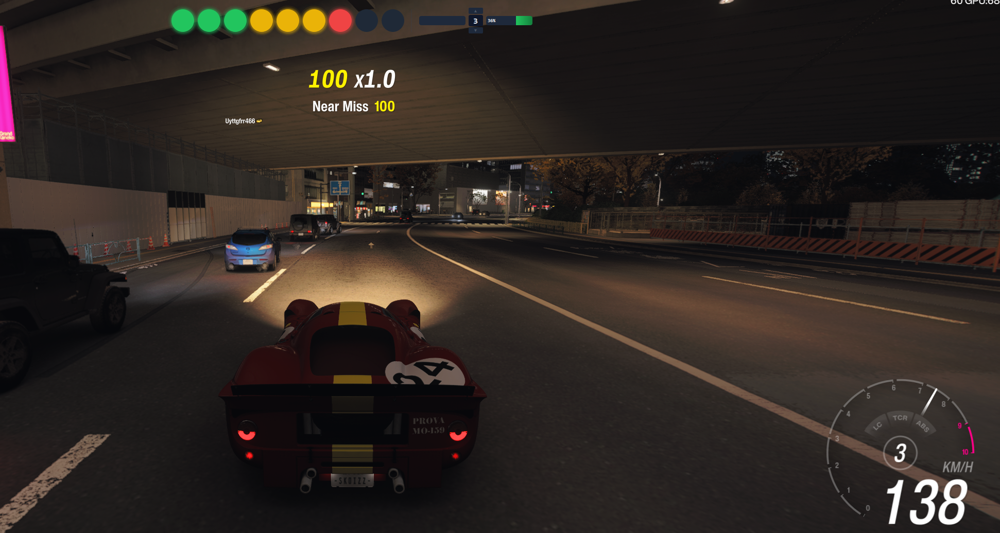

# FH6 Overlay

A lightweight always-on-top overlay for Forza Horizon 6 that displays real-time telemetry and controller input. Built with Python and PyQt6.



---

## Features

- **Rev lights** — 9 LEDs (3 green → 3 yellow → 3 red) that fill proportionally with RPM and flash when it's time to shift
- **Gear indicator** — shows current gear (1–10, R, D for electric cars)
- **Brake bar** — left trigger pressure visualised as a red bar
- **Throttle bar** — right trigger pressure visualised as a green bar
- **Shift indicators** — up/down buttons that light yellow on press and fade off gradually
- **Electric car support** — shift lights are suppressed for D/R-only cars; gear shows D or R
- **Adaptive rev limiter** — learns each car's real redline from driving and persists it to disk; calibration survives sessions and car switches
- **System tray icon** — right-click to quit; no console window required

---

## Requirements

- Windows 10/11
- Forza Horizon 6 with **Car Dash** telemetry output enabled
- An Xbox / XInput-compatible controller (controller section is optional — overlay still works without one)

### Python dependencies (for running from source)

```
PyQt6
```

Install with:

```
pip install PyQt6
```

---

## Installation

### Option A — Pre-built executable

1. Download `FH6Overlay.exe` from the [Releases](../../releases) page
2. Place it anywhere on your PC
3. Run it — a red dot appears in the system tray when it is active

### Option B — Run from source

```
git clone https://github.com/SkoiZz94/FH6Overlay
cd FH6Overlay
pip install PyQt6
python overlay.py
```

---

## Forza Horizon 6 Setup

1. In-game go to **Settings → HUD and gameplay → Car Dash Telemetry**
2. Set **Data Out** to **On**
3. Set **Data Out IP Address** to `127.0.0.1`
4. Set **Data Out IP Port** to `20777`

The overlay listens on UDP port 20777 on localhost. If the game is running on a different PC, change the IP accordingly and update `UDP_PORT` in `overlay.py`.

---

## Usage

Start the overlay before or after launching the game — it connects automatically when packets arrive and disconnects when they stop.

| Action | Result |
|--------|--------|
| Launch `FH6Overlay.exe` | Overlay appears at top-centre of screen |
| Right-click system tray icon | Context menu with **Quit** |
| `Escape` or `Ctrl+Q` | Quit (when overlay window has focus) |
| `Ctrl+C` in terminal | Quit (when running from source) |

The overlay window is frameless and click-through — it will not interfere with game input.

---

## Rev Light Calibration

The overlay learns the correct shift point for each car automatically:

- **First drive** — uses the game's reported max RPM. Lights may flash slightly early on the very first high-RPM run.
- **After the first upshift at high RPM** — the RPM peak just before the shift is saved as the calibrated redline for that car.
- **Every subsequent session** — the calibrated value is restored instantly on the first packet, so lights behave correctly from the moment you start driving.

Calibration data is stored in `calibration.json` next to the executable. You can delete this file to reset all calibrations, or open it to inspect or manually edit individual values. Keys are in the format `max_rpm,idle_rpm`.

### Electric cars

Electric cars (idle RPM = 0) are detected automatically. Their shift lights remain unlit since there is no shift concept, and the gear indicator shows **D** (drive) or **R** (reverse).

---

## Project Structure

```
FH6Overlay/
├── overlay.py          # Qt GUI — rev lights, gear box, controller bars, tray icon
├── telemetry.py        # UDP listener, packet parsing, RPM ratio, calibration logic
├── controller.py       # XInput polling for triggers and shift buttons
├── calibration.json    # Per-car rev limiter data (auto-generated, human-readable)
├── tests/
│   ├── test_telemetry.py
│   └── test_controller.py
└── conftest.py
```

---

## Packet Format

The overlay uses the FH6 **Car Dash** UDP format (324 bytes per packet):

| Field | Offset | Type |
|-------|--------|------|
| Max RPM | 8 | float32 |
| Idle RPM | 12 | float32 |
| Current RPM | 16 | float32 |
| Gear | 319 | uint8 |

Gear encoding: `0` = Reverse, `1–10` = forward gears, `255` = Reverse (normalised to match `0`).

---

## Running Tests

```
python -m pytest tests/
```

All 49 tests cover packet parsing, RPM ratio computation, light state logic, calibration behaviour, and controller input processing.

---

## Building the Executable

```
pip install pyinstaller
python -m PyInstaller --onefile --windowed --name FH6Overlay overlay.py
```

Output: `dist\FH6Overlay.exe`

> **Note:** First launch is slow (~5–10 s) because `--onefile` extracts itself to a temp folder. This is normal PyInstaller behaviour.

---

## Customisation

All tunable values are constants at the top of their respective files:

**`overlay.py`**

| Constant | Default | Description |
|----------|---------|-------------|
| `UDP_PORT` | `20777` | UDP port to listen on |
| `LIGHT_SIZE` | `44` px | Diameter of each rev light |
| `SHIFT_FADE_MS` | `300` ms | How long shift indicators glow after release |
| `UPDATE_MS` | `50` ms | Repaint interval (20 fps) |

**`telemetry.py`**

| Constant | Default | Description |
|----------|---------|-------------|
| `SHIFT_RATIO` | `0.93` | RPM fraction at which lights start flashing |
| `_PEAK_ACTIVATE_FRAC` | `0.65` | Minimum RPM fraction before calibration is attempted |
| `_MAX_HEADROOM` | `1.03` | Calibrated max = observed peak × this |

**`controller.py`**

| Constant | Default | Description |
|----------|---------|-------------|
| `SHIFT_UP_BTN` | `0x2000` (B) | XInput bitmask for the shift-up button |
| `SHIFT_DOWN_BTN` | `0x4000` (X) | XInput bitmask for the shift-down button |

---

## Vibe coded

This project was built entirely through conversation with [Claude](https://claude.ai) — no code was written by hand. Architecture decisions, bug fixes, packet format reverse-engineering, and tests were all driven by describing problems and iterating on the output. The packet offset for the FH6 gear byte (319 vs. the FH5 value of 307) was discovered by capturing a live debug dump and having Claude scan it for the byte that changed with gear changes.

If something is broken, it is probably Claude's fault.

---

## License

MIT
